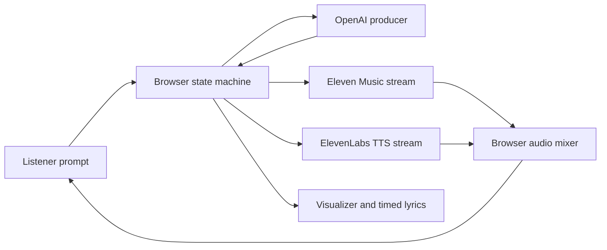

# Robot Radio Infinity

Robot Radio Infinity is a personal radio station that creates and presents every track live for one listener.

The listener can request a sound, redirect the next track, demand an immediate change, or chat with the DJ. The station keeps playing while its producer plans the next move.

This is not a generated playlist with speech between songs. It models radio production as a live system with ramps, links, transitions, buffers, memory, and editorial timing.

## What makes it radio

- Eleven Music streams each original track while it generates.
- OpenAI runs a bounded producer and presenter with rolling show memory.
- ElevenLabs TTS gives the DJ a consistent broadcast voice.
- A deterministic reducer owns playback, fades, speech windows, and recovery.
- The browser decodes and mixes compressed audio with the Web Audio API.
- The visualizer combines live spectrum data, track energy, and timed lyrics.

The first listener prompt starts two paths at the same time. A short generated ident opens the station while the producer plans the first full track.

## Signal flow



The model proposes editorial intent. The reducer decides what the station can do and when it can do it.

## Repository layout

```text
apps/eleven/web       Active React client, state machine, visualizer, and Web Audio runtime
apps/eleven/server    Active OpenAI and ElevenLabs routes, streams, and provider adapters
apps/eleven/shared    Active contracts and schemas

apps/google/web       Frozen Google client and state machine
apps/google/server    Frozen Gemini and Lyria providers
apps/google/shared    Frozen Google contracts and schemas

docs                  Architecture and deployment guides
```

The active ElevenLabs application and the frozen Google application do not share orchestration code. Their music models require different timing and state-machine designs.

## Start locally

Use Node.js 24 and pnpm 10.

1. Install the packages:

   ```bash
   pnpm install
   ```

2. Copy the environment template:

   ```bash
   cp apps/eleven/.env.example .env
   ```

3. Select the free mock providers in `.env`:

   ```text
   PROVIDER_STACK=mock
   ```

4. Start the application:

   ```bash
   pnpm dev
   ```

5. Open [http://localhost:5173](http://localhost:5173).

The mock provider stack uses generated fixtures. It makes no paid provider calls.

The environment template selects the live stack for Vercel. Add the two provider keys to use it locally.

```text
PROVIDER_STACK=eleven
OPENAI_API_KEY=your-key
ELEVENLABS_API_KEY=your-key
```

## Commands

```bash
pnpm dev          # Start the active web and server packages
pnpm test         # Run the active test suites
pnpm typecheck    # Type-check the active packages
pnpm build        # Build the active application
pnpm verify       # Run tests, type checks, and the production build
```

The frozen Google AI Studio application uses npm. Run its commands with an explicit `:google` suffix.

## Deploy

The repository includes a Vercel Services configuration. It deploys the Vite client and the WebSocket server on one domain.

The production API fails closed when `DEMO_PASSWORD` is missing. A successful login sets a signed, HttpOnly access cookie.

Read the [Vercel deployment guide](docs/deployment-vercel.md) before the first live deployment.

## Documentation

- [Active application guide](apps/eleven/README.md)
- [System architecture](docs/architecture.md)
- [Vercel deployment guide](docs/deployment-vercel.md)
- [Contributing](CONTRIBUTING.md)
- [Security policy](SECURITY.md)

The Eleven Music fixture corpus supports timing and presentation tests without new generations. Paid profiling commands require an explicit `--confirm-cost` flag.

## License

The source code and documentation are available under the [MIT License](LICENSE).

Audio generated by a deployed station is not distributed by this repository. The MIT license does not cover the MP3 files in the golden test corpus. Those files are test inputs and remain subject to the rights and terms that apply to them.
